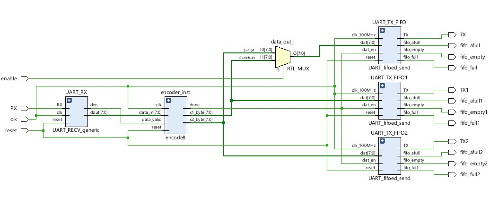
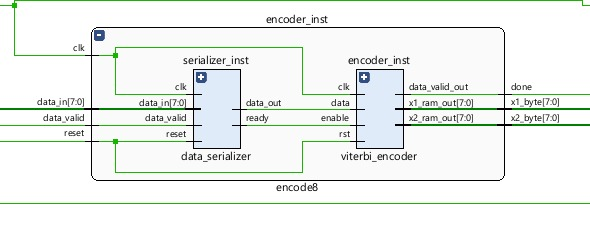
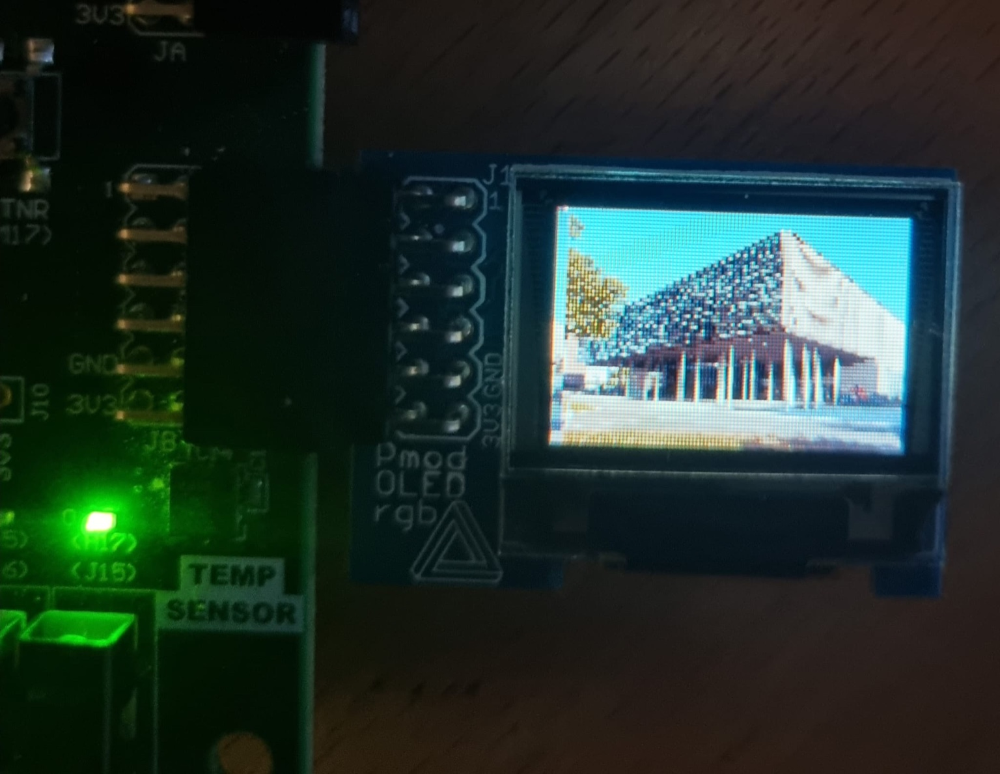
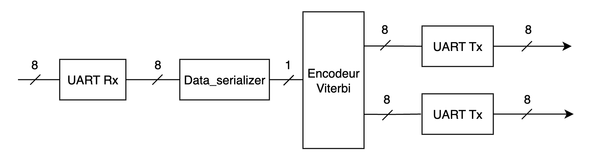
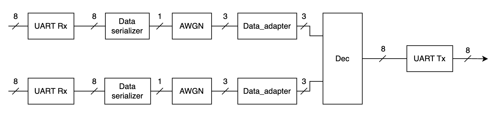
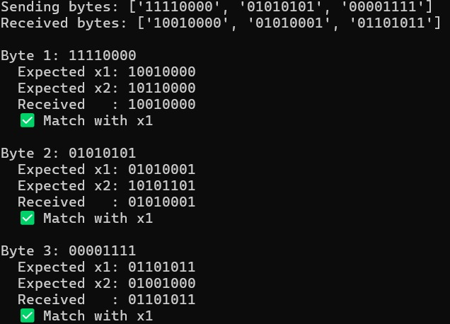
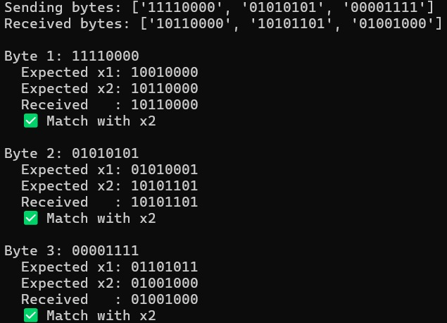

##  **Documentation**

---

#  Table des matières

* [1. Introduction générale](#1-introduction-générale)
* [2. Architecture globale du démonstrateur](#2-architecture-globale-du-démonstrateur)

  * [2.1 Schéma global du système](#21-schéma-global-du-système)
  * [2.2 Description fonctionnelle](#22-description-fonctionnelle)
  * [2.3 Communication UART](#23-communication-uart)
* [3. Fonctionnement du démonstrateur – Chaîne complète](#3-fonctionnement-du-démonstrateur--chaîne-complète)

  * [3.1 Flux de données](#31-flux-de-données)
  * [3.2 Implémentation sur FPGA Nexys A7](#32-implémentation-sur-fpga-nexys-a7)
* [4. Description des modules VHDL](#4-description-des-modules-vhdl)

  * [4.1 Émetteur (FPGA 1)](#41-émetteur-fpga-1)
  * [4.2 Canal bruité (FPGA 2)](#42-canal-bruité-fpga-2)
  * [4.3 Récepteur et décodage (FPGA 3)](#43-récepteur-et-décodage-fpga-3)
* [5. Affichage d’image sur écran PMOD OLED](#5-affichage-dimage-sur-écran-pmod-oled)
* [6. Modules VHDL détaillés](#6-modules-vhdl-détaillés)

  * [6.1 Affichage](#61-affichage)
  * [6.2 Encodage Viterbi](#62-encodage-viterbi)
  * [6.3 Canal bruité (AWGN)](#63-canal-bruité-awgn)
  * [6.4 Décodage Viterbi](#64-décodage-viterbi)
* [7. Simulations VHDL](#7-simulations-vhdl)
* [8. Scripts Python – Transmission UART](#8-scripts-python--transmission-uart)

  * [8.1 Connexion UART](#81-connexion-uart)
  * [8.2 Envoi/Réception de l’image](#82-envoiréception-de-limage)
  * [8.3 Bruit et SNR simulé](#83-bruit-et-snr-simulé)
  * [8.4 Encodeur/Décodeur Viterbi en Python](#84-encodeurdecodeur-viterbi-en-python)
  * [8.5 Conversion RGB565](#85-conversion-rgb565)
* [9. Résultats et observations](#9-résultats-et-observations)
* [10. Conclusion et perspectives](#10-conclusion-et-perspectives)


## **1. Introduction générale**

Ce document a pour objectif de présenter en détail le fonctionnement du démonstrateur d’erreurs conçu autour de la transmission d’images via un système émetteur-canal-récepteur. Ce projet a été implémenté sur des cartes FPGA Nexys 4 basées sur des puces Artix-7, en exploitant des modules PMOD, notamment l’écran RGB OLED, pour la visualisation des résultats.

L’architecture repose sur la transmission d’une image depuis un émetteur vers un récepteur en passant par un canal de communication pouvant introduire des erreurs. L’image est tout d’abord affichée sur le PMOD OLED. Par la suite, un codage de vitterbi est appliqué à l’image avant sa transmission. Après le passage par un canal bruité (modélisé par un code vhdl de SNR ), l’image est décodée à l’aide de l’algorithme de Viterbi, puis de nouveau affichée pour visualiser l’effet de la correction d’erreurs sur notre PMOD.

La communication série entre les différents composants (émetteur, canal, récepteur) est assurée via UART. L’ensemble du système est composé des modules VHDL pour le traitement temps réel (affichage, encodage, décodage) et des scripts Python pour l'envoi d'image et le pilotage des transferts. Ce travail a été réalisé dans le cadre du projet de démonstration d’un système de transmission avec détection et correction d’erreurs.


## **2. Architecture globale du démonstrateur**

### **Figure schématique globale du système**

Le démonstrateur repose sur une architecture en trois parties principales réparties sur trois plateformes FPGA Nexys 4, chacune connectée à un PC. La communication entre les différentes cartes se fait via l’interface UART. L’image transmise traverse successivement les étapes d’émission, de bruitage (canal) et de réception avec correction d’erreurs, chacune étant visualisable à l’écran PMOD OLED connecté à chaque carte.


### **Description globale de l’architecture**

Le démonstrateur a pour objectif de représenter une chaîne de communication numérique avec visualisation de l'effet des erreurs de transmission et de leur correction sur une image.

* **Émetteur (FPGA 1)**
  Le premier FPGA reçoit une image depuis un PC via UART. Cette image est d’abord affichée sur un écran OLED connecté à la carte pour visualiser la version originale. Ensuite, elle est encodée à l’aide d’un **codeur convolutif** (type Viterbi) et transmise à la deuxième carte FPGA par liaison série.

* **Canal de transmission bruité (FPGA 2)**
  La deuxième carte FPGA reçoit les données encodées, puis applique un **bruit gaussien** avec un SNR contrôlable pour simuler un canal de transmission réel (bruit blanc additif). L’image bruitée est ensuite affichée pour montrer les erreurs introduites, puis transmise à la troisième carte.

* **Récepteur (FPGA 3)**
  La troisième carte reçoit les données bruitées. Un **décodeur Viterbi** permet de corriger les erreurs induites par le canal. L’image finale décodée est affichée à l’écran OLED, ce qui permet de comparer visuellement l’image originale, bruitée et corrigée.


## Répartition des Tâches

Le projet a été réalisé en binôme, avec une répartition claire des responsabilités afin d'assurer une progression efficace et parallèle des différentes parties du système.

#### Binôme 1(Yassine Hamioui, Hamza El Hamraoui)

* **Communication UART entre les cartes** : Mise en place de la communication série (UART) entre les deux FPGA à l’aide de scripts Python pour l’envoi et la réception des données.
* **Décodeur 8 bits** :

  * Conception initiale d’un décodeur sur 1 bit pour valider le principe de fonctionnement.
  * Extension à un décodeur 8 bits pour traiter les données complètes.
  * Intégration dans le FPGA1 pour permettre l'envoi d’une image bruitée via UART, suivie de son décodage.

#### Binôme 2( Meryem Elouassai, Marouane Lambarki)

* **Affichage d’image sur l’écran PMOD OLED** : Développement de la logique d’affichage pour visualiser l'image.
* **Encodage des données transmises par UART** :

  * Début du développement avec un encodage sur 1 bit.
  * Passage à un encodage sur 8 bits pour correspondre à la taille de l'image.
  * Modification du bloc sur le FPGA1 afin de permettre l'encodage des données en temps réel avant transmission.


##  **3. Fonctionnalité globale du démonstrateur**

###  Description du flux de données de bout en bout :

1. **Lecture de l’image**
   L’image à transmettre peut être dans différents formats standards (comme PNG, BMP, JPG, etc.). Un script Python est utilisé pour la convertir dans un format exploitable par le FPGA, généralement en données brutes (bitmap binaire). Ce traitement permet de découper et organiser les pixels afin qu'ils soient transmissibles via une liaison série UART.

2. **Transmission UART vers le FPGA Émetteur**
   Une fois l’image convertie, elle est envoyée via une liaison UART depuis le PC vers le premier FPGA (FPGA Émetteur). Ce dernier reçoit les données série à l’aide d’un module `UART_RX` implémenté en VHDL.

3. **Encodage & Canal bruité**
   Sur le FPGA Émetteur, les données d’image sont encodées à l’aide d’un encodage Viterbi. Ensuite, les données encodées sont transférées à un PC intermédiaire connecté à un deuxième FPGA qui simule un canal bruité, en injectant un bruit gaussien selon un SNR réglable. Cela permet de simuler des conditions de transmission réalistes.

4. **Réception & Décodage par Viterbi**
   Les données bruitées sont transmises à un troisième FPGA (FPGA Récepteur) où un décodeur Viterbi (implémenté en VHDL) est utilisé pour corriger les erreurs de transmission. Ce décodage restitue une version corrigée de l’image.

5. **Affichage de l’image sur PMOD RGB OLED**
   À chaque étape, l’image est convertie et affichée sur un écran RGB OLED connecté en PMOD sur chaque FPGA. Cela permet une visualisation directe du résultat de chaque étape. 


## **4. Description des modules VHDL**


## **Fonctionnalité globale de l’émetteur, du canal et du récepteur**

### **Émetteur (FPGA 1)**

Le rôle principal de l’émetteur est d’assurer la réception, l’encodage et l’envoi de l’image. Dans un premier temps, une image est transmise depuis un PC vers la carte FPGA via une interface UART, octet par octet. Ces données sont stockées dans une mémoire RAM locale, puis l’image originale est affichée sur un écran OLED afin d’avoir un aperçu de la qualité initiale.

Ensuite, chaque octet est encodé bit par bit à l’aide d’un **codeur convolutif** (Viterbi encoder), dont l’objectif est d’introduire de la redondance pour rendre la transmission plus robuste face aux erreurs. Le module `encode8` effectue ce traitement : il extrait chaque bit de l’octet, l’encode à l’aide d’un module `viterbi_encoder`, puis génère deux octets de sortie (`x1_byte`, `x2_byte`) correspondant aux deux symboles codés. Ce mécanisme permet de doubler les données à transmettre, mais augmente fortement la capacité de correction au niveau du récepteur. Une fois le codage terminé, les données sont prêtes à être transmises à la carte suivante via une liaison série.




### **Canal de transmission bruité (FPGA 2)**

Le canal représente une simulation d’un environnement de transmission réel où les données peuvent être altérées. Les octets encodés provenant de l’émetteur sont reçus, puis **un bruit gaussien additif (AWGN)** est appliqué pour simuler une dégradation du signal, typique d’un canal analogique.

Ce bruit est contrôlé par un paramètre SNR (Signal-to-Noise Ratio), qui permet de varier l’intensité du bruit injecté dans le signal. Une fois bruitées, les données sont affichées (image dégradée) puis renvoyées à la troisième carte (récepteur). Cette étape permet d’observer l’impact des perturbations sur une transmission non protégée.


### **Récepteur et Décodage (FPGA 3)**

Le récepteur a pour rôle de récupérer les données bruitées, de les décoder, puis de reconstruire l’image originale. Pour cela, il s’appuie sur un **décodage convolutif de type Viterbi**, capable de corriger les erreurs introduites par le bruit durant la transmission. Afin de permettre un traitement précis et contrôlé, une **ROM nommée `rom_sigma`** est utilisée. Cette mémoire contient des valeurs prédéfinies de sigma (écart-type du bruit), utilisées pour moduler la réponse du décodeur selon les conditions de bruit simulées. Elle permet d’ajuster dynamiquement la sensibilité du décodage en fonction du niveau de bruit reçu, en se basant sur une entrée `sb` (signal binaire) représentant un index de configuration.

En complément, un module `data_serializer` est utilisé pour **désérialiser les données** reçues. Les bits reçus en série sont regroupés en octets et stockés dans une mémoire tampon. Une fois reconstitués, ces octets sont présentés au décodeur Viterbi, qui applique son algorithme de correction basé sur les treillis de transition d’états. Ce processus permet de retrouver les données d’origine avec une grande fiabilité, malgré la dégradation subie par le canal.

Enfin, les octets corrigés sont envoyés vers un écran OLED connecté à la carte FPGA, permettant de visualiser l’image restaurée. Ce mécanisme de comparaison entre l’image originale, bruitée et décodée offre une démonstration concrète de l’efficacité du codage/décodage convolutif dans un environnement de transmission bruité.


### **Affichage de l'image sur le PMOD OLED**

Le démonstrateur implémente un système complet de lecture et d’affichage d’image sur un écran connecté via un module PMOD sur chaque FPGA. Son objectif principal est de parcourir une mémoire RAM contenant une image encodée en 1, 2, 4 ou 16 bits par pixel (BPP), de convertir si nécessaire les données en un format compatible avec l’affichage (RGB565 - 16 bits), puis de les transmettre ligne par ligne à l'écran.

L'affichage est déclenché par un signal de contrôle (`enable_pmod`) qui active la lecture séquentielle des données. Pour chaque cycle d’horloge, l’adresse de lecture est générée automatiquement à partir des coordonnées de la matrice (`col_counter`, `row_counter`). Le système incrémente ces coordonnées pour parcourir l’image pixel par pixel, tout en envoyant la position (`pix_col`, `pix_row`) et la couleur du pixel (`pix_data_out`) à l’écran. Un signal `pix_write` valide chaque écriture.

Le démonstrateur est conçu pour être générique, avec des paramètres configurables comme la largeur et la hauteur de l’écran, ainsi que la profondeur de couleur (BPP). Il supporte plusieurs formats d’image grâce à un bloc de transcodage intégré, qui convertit automatiquement les données issues de la RAM vers le format RGB565 utilisé pour l’affichage.

Une logique de réinitialisation (`reset`) est également incluse, permettant de réinitialiser les compteurs et l’état interne du module à tout moment. À la fin de l’affichage complet de l’image (lorsque tous les pixels ont été envoyés), le module désactive automatiquement le signal de validation d’écriture et attend un nouveau déclenchement.


## **5. Description des modules VHDL détaillée**


### **Partie 1 : Affichage de l'image sur un écran OLED RGB**


### **1. Fichiers VHDL pour la gestion de l'affichage**

* **`RAM_IMAGE.vhd`** : Ce module gère le stockage de l’image dans une mémoire RAM interne au FPGA. Il reçoit les données d’image (pixels) et les organise ligne par ligne. La RAM est ensuite lue séquentiellement pour permettre un affichage synchronisé sur l’écran OLED.

* **`Image_Display.vhd`** : Ce module est chargé d’envoyer les pixels à l’écran OLED RGB via le bus PMOD. Il génère les signaux de synchronisation nécessaires (`pix_row`, `pix_col`, `pix_write`, etc.) pour balayer l’image en mémoire et afficher chaque pixel dans l’ordre correct.

* **`UART_RX.vhd`** : Module de réception UART qui permet de recevoir les octets de l’image envoyés depuis le PC. Il signale la réception valide d’un octet à l’aide du signal `data_valid`.

* **`UART_TX.vhd`** : Ce module permet d’envoyer les données encodées (comme les octets Viterbi) à la carte suivante ou au PC via l’interface UART, en assurant la transmission série synchrone.

* **`bitmap.vhd`** : Ce module effectue une conversion de format pour l’affichage, en particulier vers le format **RGB565** (16 bits par pixel), à partir d’une image binaire ou en niveaux de gris. Il permet d’adapter les données stockées dans la RAM pour l’écran RGB OLED.


   


### **Partie 2 : Encodage des données (Viterbi Encoder)**

1. **Fichier VHDL pour l'encodeur Viterbi (1 bit)** :

   * **`viterbi_encoder.vhd`** : Module pour l'encodage Viterbi à 1 bit.

2. **Fichier VHDL pour l'encodeur Viterbi (8 bits)** :

   * **`viterbi_encoder_8bits.vhd`** : Module pour l'encodage Viterbi à 8 bits.
   * **`data_serializer.vhd`** : Le module data_serializer convertit des données parallèles (octets) en flux série. Il stocke les données en RAM, puis les envoie bit par bit en sortie. Il gère les pointeurs de lecture/écriture, un compteur de bits, et indique quand un bit est prêt à être lu. Certaines versions améliorent la gestion du buffer et le suivi des octets envoyés.


Nous avons utilisé le module `uart_rx` pour la réception des données série depuis l'extérieur. Ensuite, le module `uart_tx` a été utilisé pour la transmission, mais uniquement à des fins de test. Pour l'envoi réel des informations, nous avons ajouté deux modules supplémentaires : `uart_tx1` et `uart_tx2`, dédiés respectivement à l'envoi vers différents périphériques.


   


### **Partie 3 : Simulation de bruit (Canal AWGN)**

1. **Fichier VHDL pour la simulation de bruit** :

   * **`awgn_channel.vhd`** : Module pour la simulation de bruit gaussien additif (AWGN) dans le canal de communication.


### **Partie 4 : Décodage des données (Viterbi Decoder)**

1. **Fichier VHDL pour le décodeur Viterbi** :

   * **`viterbi_decoder.vhd`** : Ce module effectue le décodage Viterbi pour des données convolutivement encodées, il reconstitue les bits d’origine à partir d’un flux de données encodées bruitées.
   * **`data_adapter.vhd`** : Ce module effectue une transformation logique fixe de données codées sur 3 bits (data_in) vers une nouvelle représentation (data_out).





## **6. Simulations**


Afin de valider le bon fonctionnement de notre système de transmission de données, une (simulation pour chaque partie  a été réalisée) à l’aide d’un banc d’essai VHDL. Ces fichiers   simulent l’interconnexion des différents blocs du système, incluant l’encodage convolutif, l’ajout de bruit contrôlé via un paramètre `snr`, et le décodage Viterbi. Cette simulation permet de vérifier **le comportement temporel et logique** de l’ensemble du système sans recourir immédiatement au matériel FPGA.

Le `testbench` génère un **signal d’horloge (clk)** avec une période définie (10 ns), simule un **reset** initial, puis active progressivement les signaux de contrôle (`enable`, `dat`, `snr`) dans un scénario temporel réaliste. Le signal `snr` est configuré à sa valeur maximale (`"111111"`) pour observer le comportement du système dans un environnement fortement bruité. Le banc d’essai permet de vérifier que les données sont correctement transmises, encodées, perturbées par un bruit simulé, puis **corrigées par le décodeur Viterbi**.


## **7. Rôle des scripts Python dans la transmission de l'image via UART**


Dans le cadre de ce projet, plusieurs scripts Python ont été développés pour gérer l’ensemble du processus de transmission d’images entre un PC et un FPGA via une interface UART. Ces scripts ont permis de :

* Convertir une image en format compatible (RGB565),
* Encapsuler les données à transmettre sous forme d’octets ou de bits,
* Appliquer un codage convolutif (Viterbi) pour améliorer la robustesse face au bruit,
* Simuler la communication série (UART),
* Évaluer le comportement de l’encodeur/décodeur Viterbi.

### 7.1 Connexion UART entre le PC et le FPGA

La communication entre le PC et le FPGA a été réalisée via l'interface UART en utilisant la bibliothèque `serial` de Python. Le port série a été configuré à une vitesse de 921600 bauds, identique à celle définie dans le FPGA. Des fonctions de bas niveau ont permis l’envoi de bits ou d’octets ainsi que la réception de réponses encodées depuis le FPGA :

```python
ser = serial.Serial(port='/dev/ttyUSB1', baudrate=921600, timeout=1)

def send_bit(bit):
    ser.write(bytes([bit & 0x01]))

def receive_encoded():
    data = ser.read(1)
    ...

```

### 7.2 Envoi et réception de l’image en trames

Les images ont été transformées en trames de bits ou d’octets, puis transmises au FPGA via UART. Le processus consiste à :

1. Convertir l’image en données binaires,
2. Appliquer un codage Viterbi sur ces données,
3. Transmettre les bits encodés,
4. Réceptionner les données et les décoder sur FPGA ou sur PC.


### 7.3 Tests et validation de l’encodeur/décodeur

Des séquences binaires prédéfinies ont été envoyées au FPGA pour valider l’encodage. Les réponses ont été comparées à celles obtenues par l’encodeur Python. Des tests ont été réalisés à deux niveaux :

* Encodage bit par bit (et réception de x1/x2)
* Encodage d’un octet complet (et comparaison du byte encodé)

Exemple de test par octet :

```python
test_byte = 0b11001011
expected_x1, expected_x2 = viterbi_byte_encode(test_byte)
ser.write(bytes([test_byte]))
...
assert received == expected_x1  # Ou x2, selon enable
```

Les résultats ont montré une correspondance exacte, validant la cohérence entre l’encodeur FPGA et les modèles Python.

### 7.4 Conversion d’image en format RGB565 et transmission UART

Pour transmettre des images (par exemple à afficher sur un écran OLED), une conversion en format RGB565 (2 octets par pixel) a été réalisée. Le script Python utilise `OpenCV` pour :

* Charger et redimensionner l’image (96×64 pixels),
* La convertir en format RGB,
* Extraire les composantes rouge, vert, bleu et les reformater en 16 bits.

```python
def convert_image_to_rgb565_bytes(image_path):
    ...
    return pixel_bytes
```

Ces données sont ensuite envoyées via UART au FPGA :

```python
def send_rgb565_over_uart(pixel_bytes, serial_port):
    ...
```

Un fichier `.txt` contenant les données RGB565 est également généré pour vérification ou archivage.


## **8. Résultats et observations**


1. **Affichage réussi avec et sans bruit :**
   L'affichage de l'image a été réussi tant avec qu'avec bruit. Cependant, un problème de synchronisation a été initialement observé, où l'image devenait floue après chaque réinitialisation. Ce problème était dû à la configuration incorrecte du signal de réinitialisation et de l'activation du signal `enable` pour le PMOD. Une fois ces paramètres correctement ajustés, l'affichage a fonctionné comme prévu. En présence de bruit (ajout d'un bruit contrôlé via un SNR configurable), l'image est devenue presque entièrement floue, ce qui a bien illustré l'impact négatif du bruit sur la qualité de l'image.

2. **Récupération correcte de l’image après décodage :**
   Après le décodage des données, l'image récupérée était très proche de l'image originale, montrant que le système de décodage, même en présence de bruit, était capable de récupérer la majorité des informations. Les performances du système de décodage ont ainsi été jugées bonnes, avec seulement de très légères distorsions perceptibles dans les zones de haute fréquence de l'image.

3. **Comparaison visuelle entre image brute et image débruitée :**
   Lors de la comparaison entre l'image brute (avec bruit) et l'image débruitée, une nette amélioration de la lisibilité a été observée après débruitage. Bien que certaines imperfections subsistent dans l'image débruitée, celles-ci étaient significativement moins visibles que dans l'image brute, ce qui a permis de retrouver une image beaucoup plus fidèle à l'original.

4. **Cas 1 bit vs 8 bits : observations (qualité, fiabilité) :**
   Les tests comparant la transmission de 1 bit contre 8 bits ont montré de bonnes performances pour les deux configurations. Toutefois, la transmission par blocs de 8 bits a présenté une meilleure robustesse et fiabilité, notamment face au bruit. On a fait le test sur la carte emetteur pour vérifier les octets encodées cela en utilisant un script python.
### Pour `enable=0`


### Pour `enable=1`


## **9. Conclusion**

Ce projet de démonstration d'un système de transmission avec correction d'erreurs a permis de valider l'implémentation d'un système complet basé sur l'architecture FPGA Nexys 4, combinant traitement matériel et logiciel pour la transmission d'images à travers un canal bruité. L'intégration des différentes parties du démonstrateur — émetteur, canal, et récepteur — a été réalisée avec succès, permettant de transmettre des images tout en appliquant un codage convolutif de type Viterbi pour la correction des erreurs dues au bruit.

Le système a est globalement fonctionn de manière satisfaisante, avec une visualisation claire des étapes du processus de transmission : l'image originale, l'image bruitée, et l'image corrigée après décodage. 

 Des améliorations restent possibles pour optimiser le système. Il serait intéressant d'explorer des solutions pour augmenter le débit de transmission tout en maintenant la fiabilité de la correction d'erreurs. De plus, l'intégration d'autres types de codage, ainsi que des techniques de compression d'image, pourrait également améliorer l'efficacité du système. 


